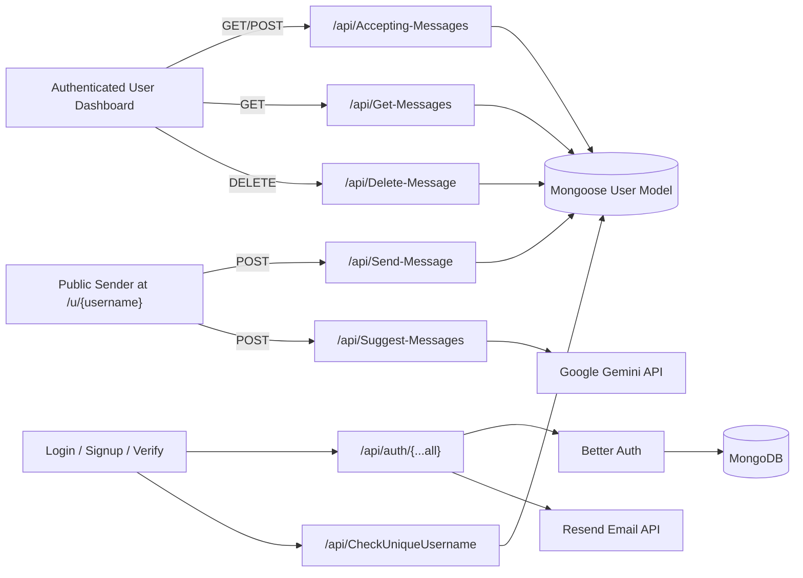

# Unsaid

A full-stack anonymous feedback platform where users create a profile, verify with OTP, share a public link, and receive honest messages in a private dashboard.

## Project Snapshot

Unsaid is designed around two experiences:

1. Recipient experience (authenticated):
   Create account, verify email, control inbox acceptance, view/delete messages, and share a public profile URL.
2. Sender experience (public/unauthenticated):
   Open a profile URL, write anonymous feedback, optionally use AI suggestions, and submit without signing in.

The project uses Next.js App Router, Better Auth, MongoDB/Mongoose, Resend email delivery, and Gemini-powered message suggestions.

## Core Capabilities

### Authentication and identity

1. Email + password sign up and login via Better Auth.
2. Google social login.
3. Email OTP verification flow.
4. Session-aware navigation and protected dashboard access.

### Anonymous feedback workflow

1. Public route at /u/[username] accepts anonymous messages.
2. Sender can request AI-generated message suggestions.
3. Recipient sees all messages in dashboard inbox.
4. Recipient can delete messages permanently.
5. Recipient can toggle whether new anonymous messages are accepted.

### UX and product design

1. Full-width marketing homepage with feature sections and professional footer.
2. Auto-moving message carousel on home page.
3. Dashboard-style UI for recipient pages.
4. Toast-based feedback for success and error states.

## Architecture Overview



## Tech Stack

| Layer          | Technologies                                                           |
| -------------- | ---------------------------------------------------------------------- |
| Framework      | Next.js 16 (App Router)                                                |
| UI             | React 19, Tailwind CSS 4, shadcn/ui, Radix UI primitives, Lucide icons |
| Language       | TypeScript                                                             |
| Authentication | Better Auth (email/password + Google + email OTP plugin)               |
| Database       | MongoDB + Mongoose                                                     |
| Email          | Resend + React Email template                                          |
| AI             | Google Generative AI (Gemini 2.5 Flash)                                |
| Validation     | Zod                                                                    |
| Notifications  | react-hot-toast                                                        |
| Linting        | ESLint 9 + eslint-config-next                                          |

## Routing Map

### App pages

| Route         | Purpose                                                               |
| ------------- | --------------------------------------------------------------------- |
| /             | Marketing home page with feature sections and moving message carousel |
| /signup       | Account creation with debounced username availability check           |
| /login        | Email/password and Google sign-in                                     |
| /verify-email | OTP verification UI and resend action                                 |
| /dashboard    | Protected recipient dashboard for inbox management                    |
| /u/[username] | Public message submission page for anonymous senders                  |

### API routes

| Endpoint                 | Method    | Auth                   | Purpose                                              |
| ------------------------ | --------- | ---------------------- | ---------------------------------------------------- |
| /api/auth/[...all]       | GET, POST | Managed by Better Auth | Core auth/session endpoints                          |
| /api/CheckUniqueUsername | GET       | No                     | Validate username availability                       |
| /api/Send-Message        | POST      | No                     | Send anonymous message to a recipient                |
| /api/Suggest-Messages    | POST      | No                     | Generate or serve cached/fallback suggestion prompts |
| /api/Accepting-Messages  | GET, POST | Yes                    | Read/update recipient message acceptance status      |
| /api/Get-Messages        | GET       | Yes                    | Fetch recipient messages (newest first)              |
| /api/Delete-Message      | DELETE    | Yes                    | Delete a specific recipient message                  |

## Detailed API Contracts

### 1) POST /api/Send-Message

Request body:

```json
{
  "username": "recipient_username",
  "content": "Your anonymous message here"
}
```

Validation and behavior:

1. username uses signup username rules.
2. content must be 10-300 characters.
3. Username lookup is case-insensitive exact match.
4. Rejects if user not found/not verified or not accepting messages.
5. Uses atomic $push update to append message safely.

### 2) POST /api/Suggest-Messages

Behavior:

1. Calls Gemini to generate 3 prompt-style suggestions separated by ||.
2. Caches generated suggestions for 1 minute.
3. If rate-limited (429), enters cooldown and serves fallback suggestions.

### 3) GET/POST /api/Accepting-Messages

GET returns current recipient setting:

```json
{
  "success": true,
  "isAcceptingMessages": true
}
```

POST request body:

```json
{
  "acceptingMessages": false
}
```

### 4) GET /api/Get-Messages

Behavior:

1. Requires authenticated session.
2. Uses aggregation to unwind/sort/regroup embedded messages by createdAt descending.

### 5) DELETE /api/Delete-Message

Request body:

```json
{
  "messageId": "mongodb_object_id"
}
```

Behavior:

1. Requires authenticated session.
2. Validates messageId format.
3. Uses $pull to remove the embedded message from the owner document.

## Data Model

Mongo document model (Mongoose):

### User

1. username: string, unique, required
2. email: string, unique, required
3. password: string, required in schema
4. isVerified: boolean
5. isAcceptingMessages: boolean
6. messages: Message[]
7. timestamps: createdAt, updatedAt

### Message (embedded in User.messages)

1. content: string (required)
2. createdAt: Date (default now)

## Validation Rules

Zod schemas enforce:

1. Username: 3-20 chars, alphanumeric + underscore only.
2. Password: min 6 chars.
3. Email: valid email format.
4. OTP code: exactly 6 chars.
5. Message content: 10-300 chars.
6. Accepting flag: boolean.

## UI and Component Design

Key components:

1. Global navigation bar with session-aware actions.
2. MessageCard with delete confirmation dialog and API integration.
3. MessageTimeCarousel for animated home-page social proof.
4. Public profile page built with dashboard-like two-column composition.

UI system:

1. Tailwind CSS v4 + shadcn tokens in global stylesheet.
2. Shared primitives in components/ui.
3. Lucide icons used consistently across pages.

## Project Structure

```text
unsaid/
├─ src/
│  ├─ app/
│  │  ├─ api/
│  │  │  ├─ Accepting-Messages/
│  │  │  ├─ auth/[...all]/
│  │  │  ├─ CheckUniqueUsername/
│  │  │  ├─ Delete-Message/
│  │  │  ├─ Get-Messages/
│  │  │  ├─ Send-Message/
│  │  │  └─ Suggest-Messages/
│  │  ├─ dashboard/
│  │  ├─ login/
│  │  ├─ signup/
│  │  ├─ u/[username]/
│  │  ├─ verify-email/
│  │  ├─ globals.css
│  │  ├─ layout.tsx
│  │  └─ page.tsx
│  ├─ components/
│  │  ├─ MessageCard.tsx
│  │  ├─ MessageTimeCarousel.tsx
│  │  ├─ NavBar.tsx
│  │  └─ ScrollVisualShowcase.tsx
│  ├─ helpers/
│  │  └─ SendVerificationMail.ts
│  ├─ lib/
│  │  ├─ auth-client.ts
│  │  ├─ auth.ts
│  │  ├─ DBConnection.ts
│  │  └─ emailsend.ts
│  ├─ models/
│  │  └─ user.ts
│  └─ velidationSchemas/
│     ├─ acceptMessageSchema.ts
│     ├─ loginSchemaVelidation.ts
│     ├─ messageSchema.ts
│     ├─ signupSchemaVelidation.ts
│     └─ verifySchema.ts
├─ components/ui/
├─ EmailTemplets/
├─ lib/utils.ts
└─ README.md
```

## Environment Configuration

Create a local environment file and define the following:

```env
MONGO_URI=
BETTER_AUTH_SECRET=
BETTER_AUTH_URL=
GOOGLE_CLIENT_ID=
GOOGLE_CLIENT_SECRET=
RESEND_API_KEY=
GEMINI_API_KEY=
```

Notes:

1. BETTER_AUTH_URL should match your app origin in the active environment.
2. Current auth client is configured with baseURL http://localhost:3000.
3. Resend sender address is onboarding@resend.dev in current implementation.

## Local Development

### Prerequisites

1. Node.js 18+
2. npm
3. MongoDB database access
4. Google OAuth credentials
5. Resend API key
6. Gemini API key

### Setup

```bash
git clone https://github.com/sujal7122005/Unsaid-Anonymous-feedback-web-application.git
cd Unsaid-Anonymous-feedback-web-application
npm install
npm run dev
```

Open http://localhost:3000.

## Scripts

| Script        | Purpose                                |
| ------------- | -------------------------------------- |
| npm run dev   | Start local Next.js development server |
| npm run build | Build production bundle                |
| npm run start | Run production server from build       |
| npm run lint  | Run ESLint checks                      |

## Product Flow You Can Recall Quickly

1. User signs up and verifies email via OTP.
2. User logs in and lands on dashboard.
3. Dashboard generates shareable profile URL /u/[username].
4. Anonymous sender opens that URL and writes message.
5. Sender can request AI suggestions and click to autofill text.
6. Message goes to recipient embedded messages array in MongoDB.
7. Recipient refreshes dashboard inbox, reviews, and can delete messages.
8. Recipient can toggle message acceptance ON/OFF at any time.

## Operational Notes

1. API route naming currently uses PascalCase segments (for example Send-Message).
2. The legacy component src/components/ScrollVisualShowcase.tsx exists but home currently uses MessageTimeCarousel.
3. Delete and send message APIs use atomic Mongo update operations for robust writes.
4. Global toaster is mounted in root layout for consistent notifications.

## Known Limitations and Improvement Ideas

1. No automated test suite yet.
2. No explicit API rate limiting on Send-Message endpoint.
3. README assumes local-first base URL in auth client.
4. Metadata title/description in layout still default scaffold values.

Potential next improvements:

1. Add integration and API tests.
2. Add rate limiting and anti-spam strategy for public message route.
3. Add environment-specific auth client base URL handling.
4. Add observability for API and auth flows.

## Contributing

Contributions are welcome through issues and pull requests. Keep changes small, focused, and lint-clean.

## License

License details are not specified yet.

## Author

Sujal
GitHub: https://github.com/sujal7122005
