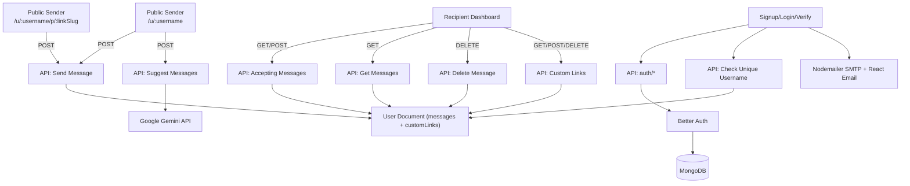

# Unsaid

Unsaid is a full-stack anonymous feedback platform where users share a public link and receive honest feedback in a private dashboard.

## Live App

https://www.unsaidfacts.me/

## Project Overview

Unsaid is built around two product experiences:

1. Recipient (authenticated):
   - Sign up/login and verify email with OTP.
   - Share a general public link and up to 2 custom product links.
   - Control whether anonymous messages are accepted.
   - View, filter, refresh, and delete messages by inbox.

2. Sender (public):
   - Open a recipient link (`/u/[username]`) or product link (`/u/[username]/p/[linkSlug]`).
   - Write anonymous feedback.
   - Use Gemini-powered suggestion messages when needed.

## Latest Product State

1. Landing page redesigned with a premium, Antigravity-inspired hero and animated Three.js particle surface.
2. Dashboard redesigned with enterprise-style layout, cleaner hierarchy, KPI-style summary cards, and polished inbox controls.
3. AI suggestion endpoint rewritten for anonymous feedback quality (appreciation + constructive + reflective mix).
4. Fallback suggestion pool upgraded to platform-specific feedback prompts.
5. Build and lint are passing on current main branch.

## Core Capabilities

### Authentication and Identity

1. Better Auth with email/password.
2. Google social sign-in.
3. Email OTP verification plugin.
4. Session-aware UI and protected dashboard flows.

### Anonymous Feedback Workflow

1. Public sender routes:
   - `/u/[username]` for general inbox.
   - `/u/[username]/p/[linkSlug]` for product-specific inbox.
2. Recipient can toggle anonymous intake mode.
3. Messages are stored as embedded documents in the user record.
4. Recipient can permanently delete messages.

### Multi-Inbox Support

1. General inbox is always available.
2. Up to 2 active custom links per user (`MAX_CUSTOM_LINKS = 2`).
3. Deleting a custom link also removes messages tied to that custom inbox.

### Public Embeddable Feed

1. Users can generate a secure token to fetch their 10 most recent general messages via JSON.
2. Endpoint: `GET /u/[username]/messages?token=...`
3. Includes IP and token-based rate limiting for secure external consumption.
4. Token can be regenerated directly from the dashboard.

### AI Suggestion Engine

1. Endpoint: `POST /api/Suggest-Messages`.
2. Gemini model: `gemini-2.5-flash`.
3. Prompt constraints generate exactly 3 high-quality anonymous feedback suggestions.
4. Output style enforced:
   - one appreciation-style suggestion
   - one constructive suggestion
   - one reflective question
5. In-memory caching (1 minute) to reduce repeated model calls.
6. Quota cooldown on 429 (30 minutes) with fallback suggestions.

## Architecture Overview

> Note: Some Markdown viewers do not render Mermaid diagrams. If you see plain code, use the text fallback right below.


```mermaid
flowchart TD
   SenderGeneral["Public Sender<br/>/u/:username"] -->|POST| SendMessage["API: Send Message"]
   SenderCustom["Public Sender<br/>/u/:username/p/:linkSlug"] -->|POST| SendMessage
   SenderGeneral -->|POST| Suggest["API: Suggest Messages"]

   Dashboard["Recipient Dashboard"] -->|GET/POST| Accepting["API: Accepting Messages"]
   Dashboard -->|GET| GetMessages["API: Get Messages"]
   Dashboard -->|DELETE| DeleteMessage["API: Delete Message"]
   Dashboard -->|GET/POST/DELETE| CustomLinks["API: Custom Links"]

   AuthUI["Signup/Login/Verify"] --> AuthApi["API: auth/*"]
   AuthUI --> UsernameCheck["API: Check Unique Username"]

   AuthApi --> BetterAuth["Better Auth"]
   BetterAuth --> Mongo[(MongoDB)]

   SendMessage --> UserData["User Document (messages + customLinks)"]
   Accepting --> UserData
   GetMessages --> UserData
   DeleteMessage --> UserData
   CustomLinks --> UserData
   UsernameCheck --> UserData

   Suggest --> Gemini["Google Gemini API"]
   AuthUI --> Mail["Nodemailer SMTP + React Email"]
```

Text fallback (for non-Mermaid viewers):

```text
Public Sender (/u/:username) -> POST /api/Send-Message
Public Sender (/u/:username/p/:linkSlug) -> POST /api/Send-Message
Public Sender -> POST /api/Suggest-Messages

Recipient Dashboard -> GET/POST /api/Accepting-Messages
Recipient Dashboard -> GET /api/Get-Messages
Recipient Dashboard -> DELETE /api/Delete-Message
Recipient Dashboard -> GET/POST/DELETE /api/Custom-Links

Signup/Login/Verify -> /api/auth/* -> Better Auth -> MongoDB
Signup/Login/Verify -> /api/CheckUniqueUsername -> MongoDB

Send/Get/Delete/Custom APIs -> User document (messages + customLinks)
Suggest API -> Gemini
Signup/Login/Verify -> Nodemailer SMTP + React Email
```

## Tech Stack

| Layer          | Technologies                                                        |
| -------------- | ------------------------------------------------------------------- |
| Framework      | Next.js 16 (App Router)                                             |
| UI             | React 19, Tailwind CSS 4, shadcn/ui, Radix primitives, Lucide icons |
| Visual Effects | Three.js, next-themes                                               |
| Language       | TypeScript                                                          |
| Auth           | Better Auth + email OTP plugin + Google OAuth                       |
| Database       | MongoDB, Mongoose                                                   |
| Email          | Nodemailer (Gmail SMTP), React Email                                |
| AI             | Google Generative AI (Gemini 2.5 Flash)                             |
| Validation     | Zod                                                                 |
| Notifications  | react-hot-toast                                                     |
| Quality        | ESLint 9, Next.js type-check/build                                  |

## App Routes

| Route                        | Purpose                                                        |
| ---------------------------- | -------------------------------------------------------------- |
| `/`                          | Marketing landing page with animated hero and feature sections |
| `/about`                     | Product about page                                             |
| `/contact`                   | Contact page                                                   |
| `/signup`                    | User registration with username checks                         |
| `/login`                     | Email/password + Google login                                  |
| `/verify-email`              | OTP verification flow                                          |
| `/dashboard`                 | Protected recipient dashboard                                  |
| `/u/[username]`              | Public general feedback page                                   |
| `/u/[username]/p/[linkSlug]` | Public product-specific feedback page                          |
| `/privacy-policy`            | Policy page                                                    |
| `/terms-of-service`          | Terms page                                                     |
| `/faq`                       | FAQ page                                                       |

## API Routes

| Endpoint                   | Method(s)         | Auth                | Purpose                                             |
| -------------------------- | ----------------- | ------------------- | --------------------------------------------------- |
| `/api/auth/[...all]`       | GET, POST         | Better Auth managed | Authentication/session                              |
| `/api/CheckUniqueUsername` | GET               | No                  | Username availability                               |
| `/api/Send-Message`        | POST              | No                  | Submit anonymous feedback (general or custom inbox) |
| `/api/Suggest-Messages`    | POST              | No                  | Generate or fallback anonymous feedback suggestions |
| `/api/Accepting-Messages`  | GET, POST         | Yes                 | Read/update acceptance mode                         |
| `/api/Get-Messages`        | GET               | Yes                 | Fetch messages by inbox (`general` or `custom`)     |
| `/api/Delete-Message`      | DELETE            | Yes                 | Delete a message                                    |
| `/api/Custom-Links`        | GET, POST, DELETE | Yes                 | Manage custom product links                         |
| `/api/Public-Feed`         | GET, POST         | Yes                 | Fetch or regenerate public feed token               |
| `/u/[username]/messages`   | GET               | Token               | Fetch latest messages for public embed              |

## Key API Contract Notes

### POST /api/Send-Message

Request body:

```json
{
  "username": "recipient_username",
  "content": "Your anonymous message",
  "customLinkSlug": "optional-product-link-slug"
}
```

Behavior:

1. Username is matched case-insensitively.
2. User must exist and be verified.
3. User must be accepting messages.
4. If `customLinkSlug` is provided, message is stored in that custom inbox.

### GET /api/Get-Messages

Query params:

- `inbox=general|custom` (default `general`)
- `customLinkId=<ObjectId>` (required when `inbox=custom`)

### POST /api/Suggest-Messages

Behavior:

1. Requests exactly 3 suggestions from Gemini in strict `||` format.
2. Response parsing normalizes common formatting noise.
3. Uses cache and quota cooldown with fallback suggestions.

### /api/Custom-Links

Behavior:

1. `GET`: returns active custom links sorted by newest first.
2. `POST`: creates a new product link with generated unique slug.
3. `DELETE`: removes selected custom link and related custom inbox messages.
4. Maximum active custom links per user: 2.

### GET /u/[username]/messages

Query params:

- `token=<string>` (required)

Behavior:

1. Validates the provided token against the user's `publicFeedToken`.
2. Returns the 10 most recent messages from the general inbox.
3. Enforces IP-based and token-based rate limits to prevent abuse.

### /api/Public-Feed

Behavior:

1. `GET`: retrieves the user's `publicFeedToken`, generating it if one doesn't exist.
2. `POST`: regenerates the `publicFeedToken`, invalidating the previous token.

## Data Model (Mongoose)

### User

1. `username`, `email`, `password`
2. `verificationcode`, `verificationcodeExpiry`, `isVerified`
3. `isAcceptingMessages`
4. `publicFeedToken`, `publicFeedTokenCreatedAt`
5. `messages: Message[]`
6. `customLinks: CustomLink[]`
7. `createdAt`, `updatedAt`

### Message (embedded)

1. `content: string`
2. `createdAt: Date`
3. `inboxType: "general" | "custom"`
4. `customLinkId?: ObjectId | null`

### CustomLink (embedded)

1. `productName: string`
2. `slug: string`
3. `isActive: boolean`
4. `createdAt: Date`

## Environment Variables

Create a `.env` file in project root:

```env
MONGO_URI=
BETTER_AUTH_SECRET=
BETTER_AUTH_URL=
NEXT_PUBLIC_BETTER_AUTH_URL=
GOOGLE_CLIENT_ID=
GOOGLE_CLIENT_SECRET=
GOOGLE_SMTP_USER=
GOOGLE_SMTP_APP_PASSWORD=
GEMINI_API_KEY=
```

Notes:

1. `BETTER_AUTH_URL` should match your active app origin.
2. `NEXT_PUBLIC_BETTER_AUTH_URL` is used by auth client in browser.
3. SMTP currently uses Gmail settings in `src/lib/emailsend.ts`.

## Local Development

### Prerequisites

1. Node.js 18+
2. npm
3. MongoDB access
4. Google OAuth credentials
5. Gemini API key
6. Gmail SMTP app password (for OTP email sending)

### Setup

```bash
git clone https://github.com/sujal7122005/Unsaid-Anonymous-feedback-web-application.git
cd Unsaid-Anonymous-feedback-web-application
npm install
npm run dev
```

Open `http://localhost:3000`.

## Scripts

| Script          | Purpose                        |
| --------------- | ------------------------------ |
| `npm run dev`   | Start local development server |
| `npm run lint`  | Run ESLint                     |
| `npm run build` | Create production build        |
| `npm run start` | Run production server          |

## Project Structure (Current)

```text
unsaid/
├─ components/
│  └─ ui/
│     ├─ alert-dialog.tsx
│     ├─ button.tsx
│     ├─ card.tsx
│     ├─ demo.tsx
│     ├─ dotted-surface.tsx
│     ├─ separator.tsx
│     ├─ switch.tsx
│     └─ theme-provider.tsx
├─ EmailTemplets/
│  └─ EmailVerification.tsx
├─ lib/
│  └─ utils.ts
├─ src/
│  ├─ app/
│  │  ├─ api/
│  │  │  ├─ Accepting-Messages/
│  │  │  ├─ auth/[...all]/
│  │  │  ├─ CheckUniqueUsername/
│  │  │  ├─ Custom-Links/
│  │  │  ├─ Delete-Message/
│  │  │  ├─ Get-Messages/
│  │  │  ├─ Send-Message/
│  │  │  └─ Suggest-Messages/
│  │  ├─ dashboard/
│  │  ├─ login/
│  │  ├─ signup/
│  │  ├─ u/[username]/
│  │  ├─ verify-email/
│  │  ├─ globals.css
│  │  ├─ layout.tsx
│  │  └─ page.tsx
│  ├─ components/
│  │  ├─ HomeFooterAccountLinks.tsx
│  │  ├─ HomeHeroActions.tsx
│  │  ├─ MessageCard.tsx
│  │  ├─ MessageTimeCarousel.tsx
│  │  └─ NavBar.tsx
│  ├─ helpers/
│  │  └─ SendVerificationMail.ts
│  ├─ lib/
│  │  ├─ auth-client.ts
│  │  ├─ auth.ts
│  │  ├─ DBConnection.ts
│  │  └─ emailsend.ts
│  ├─ models/
│  │  └─ user.ts
│  └─ velidationSchemas/
├─ package.json
└─ README.md
```

## Operational Notes

1. API route segments currently use PascalCase naming (example: `Suggest-Messages`).
2. Suggestion cache and quota cooldown are in-memory (runtime instance scoped).
3. Public sender flow is intentionally no-auth for easy anonymous feedback collection.
4. Toaster notifications are mounted globally in root layout.

## Current Gaps / Next Improvements

1. No automated unit/integration/e2e test suite yet.
2. No explicit public API rate limiting/anti-spam middleware yet.
3. In-memory suggestion cache is not shared across server instances.
4. Monitoring and observability can be expanded (request traces, metrics, alerts).

## Contributing

Contributions are welcome through issues and pull requests. Keep changes focused, lint-clean, and build-passing.

## Author

Sujal Patel  
GitHub: https://github.com/sujal7122005
